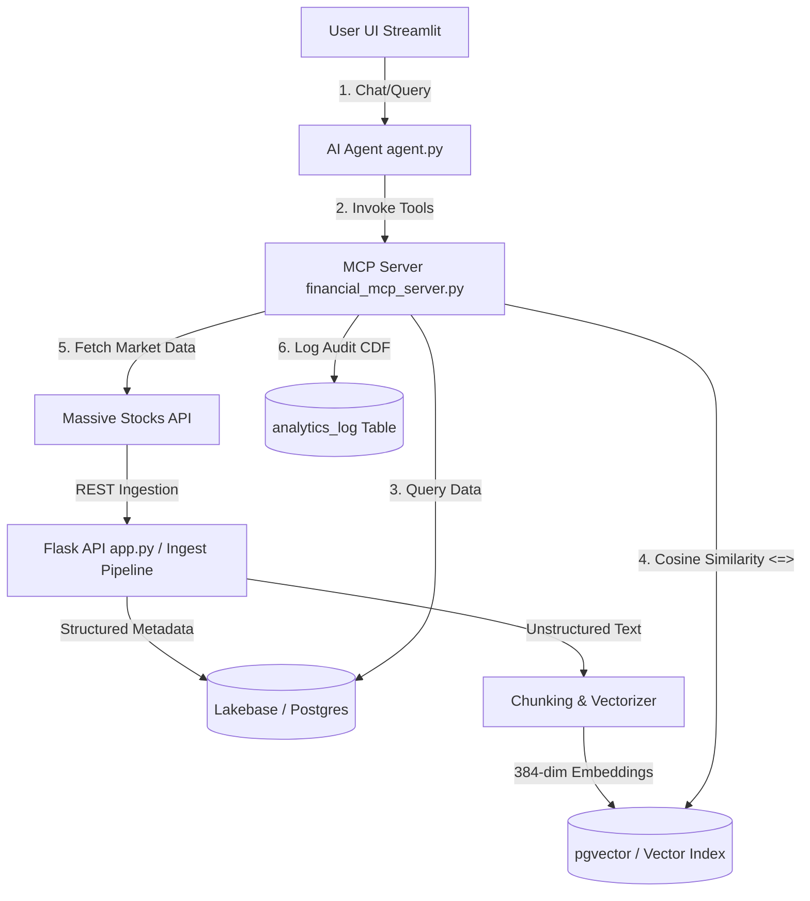

# Capstone Project: AI Stock Market Research Assistant

An end-to-end data engineering and agentic AI application built using the architecture patterns from the Databricks AI Data Engineering Bootcamp. The project features automated ingestion via the **Massive Stocks API**, incremental unstructured text chunking & embedding vectorization (`all-MiniLM-L6-v2`), semantic search, an **MCP Server**, and a dual-database system (PostgreSQL/pgvector with SQLite local fallback).

---

## 🏗️ System Architecture

The following diagram illustrates the flow of data and agentic controls:



---

## 🛠️ Project Structure

The project code is divided into modular files following the bootcamp structure:

*   `schema.sql`: DDL defining the 8 database tables.
*   `lakebase.py`: Connection adapter supporting PostgreSQL/psycopg2 and local SQLite.
*   `massive_client.py`: API broker wrapper for fetching stock prices, profiles, and news.
*   `app.py`: Flask REST API serving sync/search endpoints (Day 2 pattern).
*   `setup_secrets.py`: Automates credential synchronization with Databricks secret scopes.
*   `notebooks/ingest_ticker_news_embeddings.py`: Sentence-transformer embedding ingest pipeline.
*   `mcp_server/`: Exposes FastMCP tools to standard Agent Bricks clients.
*   `dashboard/`: Streamlit web console showing watchlists, price charts, and AI chat.
*   `Databricks_Notebook.py`: Standard importable setup script for running inside Databricks clusters.

---

## 🚀 Setup & Running Instructions

### Local Environment Setup
1. Clone your repository.
2. Copy `.env.example` to `.env` and fill in your Gemini API Key:
   ```bash
   cp .env.example .env
   ```
3. Install required python libraries:
   ```bash
   pip install -r requirements.txt
   ```
4. Run setup migrations to create tables and load sample stock news:
   ```bash
   python run_setup.py
   ```
5. Spin up the background Flask REST API:
   ```bash
   python app.py
   ```
6. Launch the Streamlit dashboard app:
   ```bash
   streamlit run dashboard/app.py
   ```

### Databricks Deployment Setup
1. Upload the files to your Databricks Repo folder.
2. Open and run the cells in `Databricks_Notebook.py` step-by-step.
3. To upload secrets to Databricks Secrets scope, configure your `.env` file and run:
   ```python
   # Run in a notebook cell
   %sh python setup_secrets.py
   ```

---

## 🔧 Registered MCP Tools

The agent uses these tools (defined in `mcp_server/financial_mcp_server.py`) to execute actions:

1.  `get_stock_summary(ticker)`: Live price, high/low range, and 30-day performance.
2.  `get_company_context(ticker)`: Full profile summary, 10-K filings, and news highlights.
3.  `compare_tickers(tickers)`: Comma-separated list side-by-side comparison.
4.  `manage_watchlist(action, ticker)`: Adds or removes tickers from database tracking.
5.  `save_research_report(ticker, report_text)`: Saves agent reports.
6.  `check_watchlist_updates()`: Identifies watchlist assets with high price variance (>1.5%).
7.  `semantic_company_search(query)`: Cosine similarity vector search matching companies by conceptual themes.

---

## 📝 Capstone Reflections (For Submission)

Here are the reflection answers detailing the technical implementation and differences from traditional analytics structures:

### 1. What was the most difficult part of the implementation?
The most challenging part of the implementation was designing a robust dual-database connection layer (`lakebase.py`) that could natively run on both a production Databricks cluster (utilizing PostgreSQL + the `pgvector` extension with the `<=>` operator) and a local developer environment. SQLite doesn't natively support vector data types or cosine similarity operators. Implementing a numpy-based python translation layer to calculate similarity on the SQLite fallback bypassed this limitation, ensuring zero-configuration local debugging.

### 2. How is Lakebase different from storing this data in a traditional analytics table?
Lakebase (acting as a serverless operational database) supports ACID transactions, low-latency lookups, and fast write-paths which are essential for real-time applications like watchlist management and logging audit logs in near-real-time. Additionally, through the `pgvector` extension, it natively indexes and queries high-dimensional vector embeddings directly alongside traditional relational metadata. In contrast, standard analytics tables (like raw Delta/Parquet tables optimized for OLAP) are structured for column-oriented batch reads and lack direct, index-optimized vector operations.

### 3. What feature would you add next?
The next high-priority feature would be to implement a scheduled change-data-capture (CDC) pipeline. Instead of running news vectorization as a manual script, we would use Databricks Delta Live Tables (DLT) or a scheduled job to listen to update events on the `news_articles` table (via Change Data Feed), auto-generate chunk embeddings via a model serving endpoint, and load them into Lakebase incrementally.
